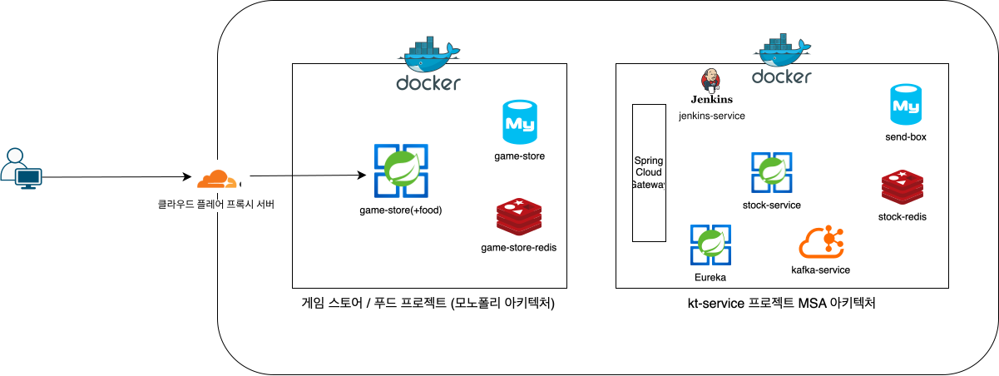

# Kt-Service

## 1. 프로젝트의 목적
* 기존 모놀리식 개발 방식을 벗어나 MSA 구조의 개발 환경 구성
* 깃 컨벤션을 준수하고, 커밋 이력 추적이 가능한 단위별로 커밋 메시지 작성
* 단위 테스트, 통합 테스트 작성
* 로컬 환경에서 CI/CD 파이프라인 구현
* 강의나 책을 통해 학습한 내용은 요구사항 정의 -> 구현 단계를 통한 실전 학습 파이프라인 환경 구성
* <a href="https://www.mrlee-food.click" target="_blank" rel="noopener noreferrer"> 운영서버 바로가기 </a>

## 2. 기술 스택
* 백엔드: Java 17, Spring Boot 3.5, Spring Data JPA
* 데이터베이스: MySQL, Redis
* 분산 메시징: Kafka
* 아키텍처: MSA (Spring Cloud Gateway, Eureka)
* 테스트: JUnit5

## 3. 시스템 아키텍처
### 서버 노트북
 - 맥북 Pro 13 M2칩
 - CPU 8코어
 - 램 16GB

## 4. 주요 기능

### 종목

#### 목록 조회

- 종목 정보 제공
  - 표준코드
  - 단축코드
  - 한글 종목명
  - 한글 종목약명
  - 영문 종목명
  - 상장일
  - 시장구분
  - 증권구분
  - 소속부
  - 주식종류
  - 액면가
  - 상장주식수
- 검색 기능 (단축코드, 한글 종목명, 한글 종목약명, 영문 종목명)
- 정렬 기능 (단축코드, 한글 종목약명, 상장일, 상장주식수)
- 필터 기능 (시장구분, 증권구분, 소속부, 주식종류)

##### 참고사항
- 검색 방식: 부분 일치(Contains)를 사용한다
- 필터 방식: 다중 조건으로 여러 개를 동시에 적용할 수 있고 AND 조건으로 동작한다

##### 테스트 상세
- [단위] 조건 없는 목록 조회 시, ID 기준 내침차순으로 정렬되어 반환된다
- [단위] 다중 정렬 조건으로 목록 조회 시, 상장일 최신순으로 우선 정렬되며 상장일이 같으면 주식수가 많은 순으로 정렬되어 반환된다
- [단위] 필터 조건이 없으면, 전체 종목을 조회한다
- [단위] 조건을 만족하는 데이터가 없므면, 빈 목록을 반환한다.

#### 인기 종목 Top10 목록 조회
- 현재 스코어가 가장 높은 상위 10개 종목의 목록을 조회
- 인기 종목 정보 제공
  - 순위
  - 종목 ID
  - 한글 종목명
  - 단축코드
  - 시장구분 한글명

##### 구현 상세
- 레디스 ZSet 자료구조 사용

##### 테스트 상세
- [단위] 레디스에서 조회한 ID 순서가 인기 종목 목록에 적용 되어야 한다.
- [단위] 레디스에 인기 종목 데이터가 존재하지 않으면, 빈 목록을 반환해야 한다. 

#### 한정 종목 재고 설정
- 특정 종목에 대해 한정 종목을 설정하는 기능
- 파라미터
  - 종목 ID
  - 재고 수량

##### 구현 상세
- 레디스 String 자료구조 사용
- 유효 기간 (레디스 TTL 1일)

##### 테스트 상세
- [단위] 한정 종목 설정에 성공하면 Http 200 OK와 성공 메시지를 반환한다.

#### 한정 종목 선착순 매수 신청
- 한정 수량 종목에 대해 선착순으로 매수 신청을 처리하는 기능
- 파라미터
  - 종목 ID
  - 한정 종목 ID
  - 사용자 ID

##### 구현 상세
- purchase_limited_stock.lua 스크립트
  - 중복 구매 검증, 잔여 수량 검증, 수량 차감, 구매 유저 명부 등록 단계를 하나의 스크립트로 처리
- 유저당 하나의 수량만 매수가 가능하다
- 수량이 모두 소진된 이후에는 매수가 불가능하다
- 매수 성공 여부에 대한 결과는 LimitedOfferResult 열거형 클래스 값으로 판단한다.
- 매수에 성공한 경우는 카프카 메시지가 발행 되고, StockLimitedOfferPurchase 엔티티로 저장된다.

##### 테스트 상세
- [단위] 한정 종목 매수에 성공하면, 카프카 메시지를 정상 발행한다.
- [단위] 한정 종목 매수에 실패하면, 카프카 메시지를 발행하지 않는다.
- [통합] 한정 상품 수량이 100개 존재하고, 1,000명이 동시 매수 요청 시 100명만 매수에 성공한다.
- [통합] 동일한 유저가 동시에 여러 번 매수 신청을 해도 한 번만 성공 처리된다.
